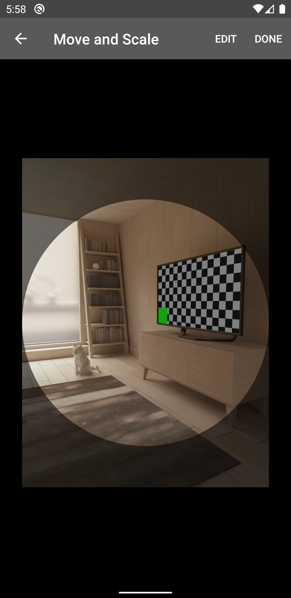

## Image Cropper

**Include the library**

 ```
 allprojects {
		repositories {
			...
			maven { url 'https://jitpack.io' }
		}
	}
  
 dependencies {
     implementation 'com.github.mukhatov:image-cropper:1.0.2'
 }
 ```

Add permissions to manifest

 ```
 <uses-permission android:name="android.permission.READ_EXTERNAL_STORAGE"/>
 ```
 
**Using Activity**

 Add `CropperActivity` into your AndroidManifest.xml
 ```xml
    <activity android:name="com.cropper.CropperActivity"
              android:screenOrientation="portrait"/>
 ```

 Start `CropperActivity` from your activity
 ```kotlin
    startActivityForResult(Intent(this, CropperActivity::class.java), CROPPER_REQUEST_CODE)
 ```

 Override `onActivityResult` method in your activity to get crop result
 ```kotlin
    override fun onActivityResult(requestCode: Int, resultCode: Int, data: Intent?) {
        super.onActivityResult(requestCode, resultCode, data)
        if (resultCode == Activity.RESULT_OK && requestCode == CROPPER_REQUEST_CODE) {
            val result = data?.data
        }
    }
 ```
 
 **Using View**

 Add `CropperLayout`
 ```xml
    <com.cropper.view.CropperLayout
            android:id="@+id/cropperLayout"
            android:layout_width="match_parent"
            android:layout_height="match_parent"/>
 ```

 Set image to crop
 ```kotlin
    cropperLayout.setImageUri(uri)
 ```

 Get cropped image
 ```kotlin
    cropperLayout.getCroppedFile()
    // or
    cropperLayout.crop()
 ```
 
 **Styleables**
 
 ```xml
    <declare-styleable name="CropperLayout">
        <attr name="backgroundColor" format="color"/>
        <attr name="overlayColor" format="color"/>
        <attr name="overlayAlpha" format="integer"/>
        <attr name="borderColor" format="color"/>
        <attr name="borderWidth" format="dimension"/>
        <attr name="padding" format="dimension"/>
        <attr name="maxScale" format="float"/>
        <attr name="borderEnable" format="boolean"/>
        <attr name="mode" format="enum">
            <enum name="circle" value="0"/>
            <enum name="square" value="1"/>
        </attr>
    </declare-styleable>
 ```

 **Screenshot**

